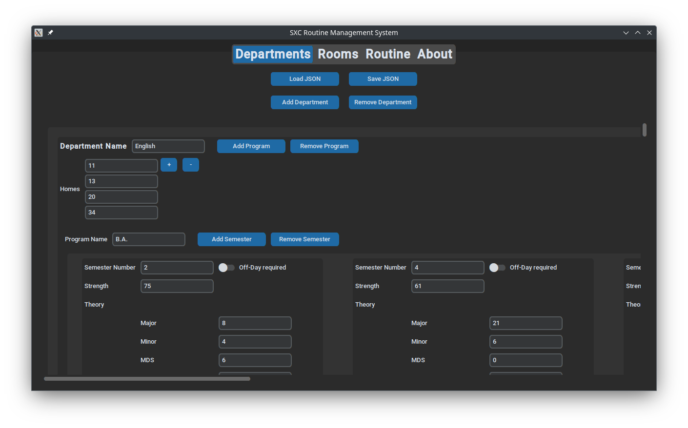
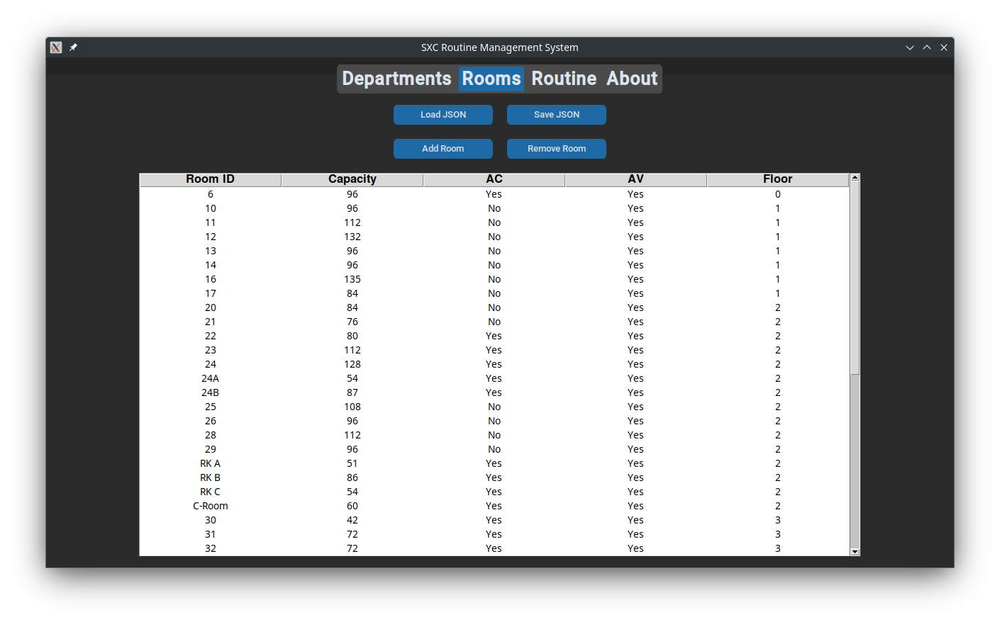
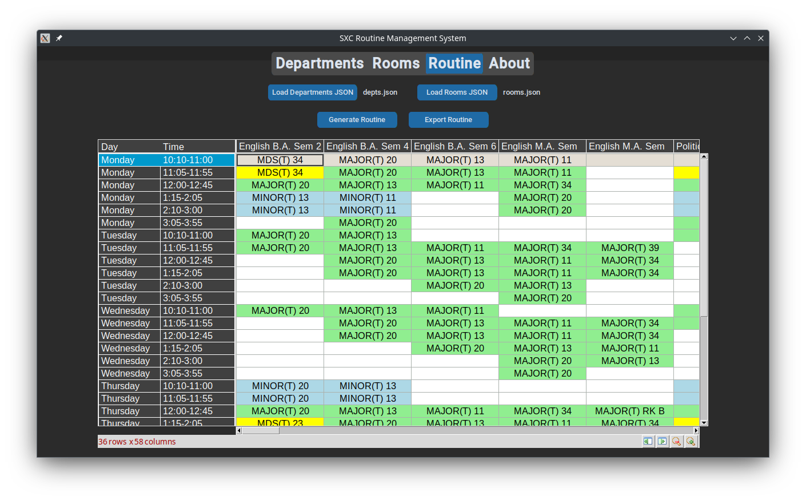

# **St. Xavier's College Routine Management System**

## **Overview**

The **SXC Routine Generator** is a robust and user-friendly tool developed to optimize routine generation processes at **St. Xavier's College (Autonomous), Kolkata**. This system simplifies the task of creating, managing, and updating academic schedules while ensuring efficiency and accuracy.

---

## **Screenshots**

Below are some screenshots showcasing the tool's functionality and interface:

### **Departments Tab**


### **Rooms Tab**


### **Routine Generation**


---

## **Setup Instructions**

### **For Linux/macOS**

1. **Create a virtual environment:**
    ```bash
    python3 -m venv .venv
    ```

2. **Activate the virtual environment:**
    ```bash
    source .venv/bin/activate
    ```

3. **Install the required dependencies:**
    ```bash
    pip install -r requirements.txt
    ```

4. **Run the application:**
    ```bash
    python3 main.py
    ```

---

### **For Windows**

1. **Create a virtual environment:**
    ```cmd
    python -m venv .venv
    ```

2. **Activate the virtual environment:**
    ```cmd
    .venv\Scripts\activate
    ```

3. **Install the required dependencies:**
    ```cmd
    pip install -r requirements.txt
    ```

4. **Run the application:**
    ```cmd
    python main.py
    ```

---

## **Contributors**  

- **[Soham Malakar](https://www.linkedin.com/in/soham-malakar-108533207/)** (Team Lead & Backend Development)  
- **[Tridib Paul](https://github.com/Tridib17)** (Frontend Development)

## **Acknowledgments**  

This project was developed under the guidance of **Dr. Sonali Sen** and **Prof. Jayati Ghosh Dastidar**, with support from the **Post Graduate and Research Department of Computer Science**, St. Xavier's College (Autonomous), Kolkata.
